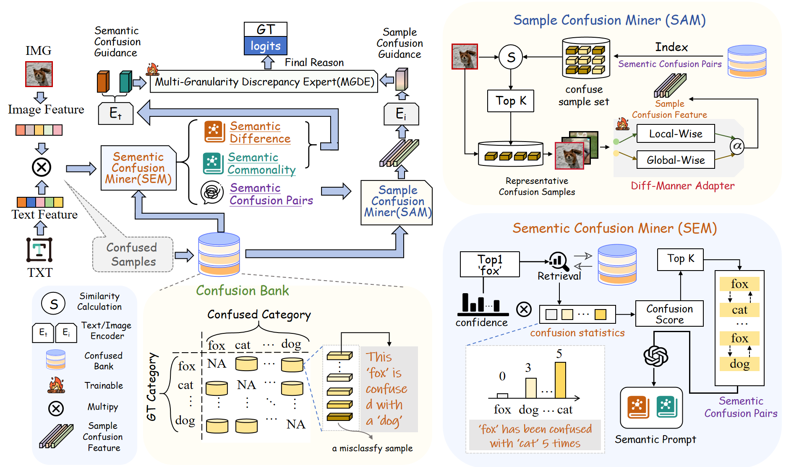
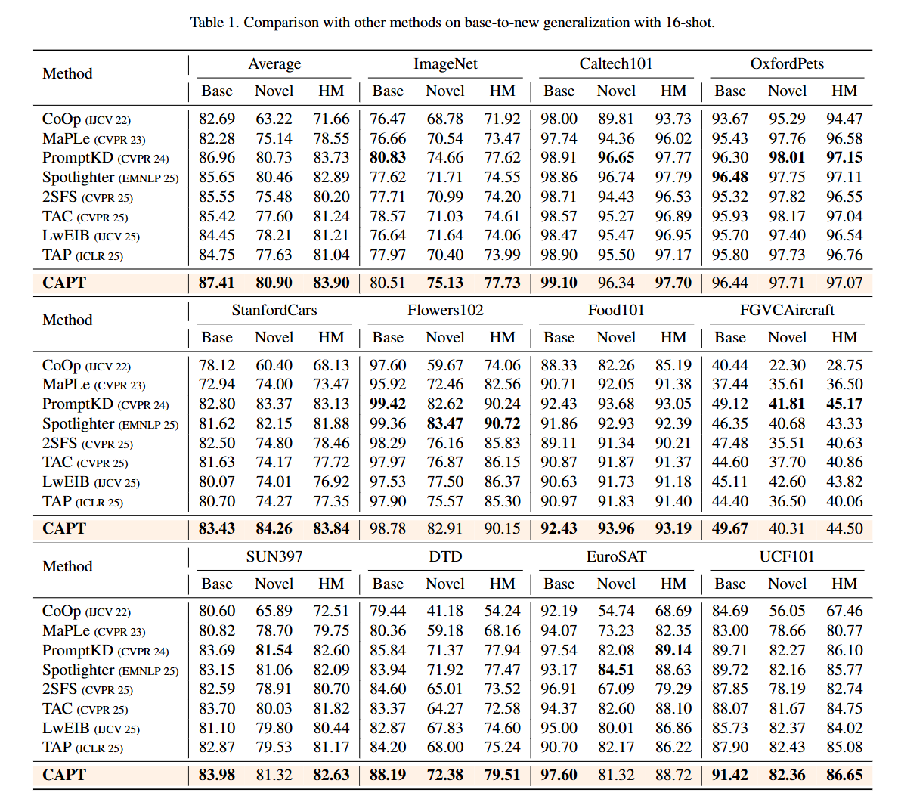

#  CAPT: Confusion-Aware Prompt Tuning for Reducing Vision-Language Misalignment

This repository contains the implementation of the CVPR2026 paper: CAPT: Confusion-Aware Prompt Tuning for Reducing Vision-Language Misalignment[[Paper]](https://arxiv.org/abs/2603.02557). 
 

### Abstract

> Vision-language models like CLIP have achieved remarkable progress in cross-modal representation learning, yet suffer from systematic misalignment among visually and semantically similar categories.
We observe that such confusion patterns are **not random but persistently occur between specific category pairs**, revealing the model’s intrinsic bias and limited fine-grained discriminative ability. <br>
>To address this, we propose CAPT, a  **C**onfusion-**A**ware  **P**rompt  **T**uning framework that enables models to learn from their own misalignment.<br>
>Specifically, we construct a Confusion Bank to model stable confusion relationships across categories and their misaligned samples explicitly.On this basis, we introduce a Semantic Confusion Miner (SEM) to capture global inter-class confusion through semantic difference and commonality prompts, and a Sample Confusion Miner (SAM) to retrieve representative misclassified instances from the bank and capture sample-level cues through a Diff-Manner Adapter that integrates global and local contexts.To further unify confusion information across different granularities, a Multi-Granularity Discrepancy Expert (MGDE) module is designed to jointly leverage semantic and sample level experts for more robust confusion-aware reasoning.<br>

>Extensive experiments on 11 benchmark datasets demonstrate that our method significantly reduces confusion-induced errors while enhancing the discriminability and generalization of both base and novel classes, successfully resolving **50.72%** of confusable sample pairs. 

### Framework 

<div style="text-align:center"></div>

<figcaption class="content has-text-left"  style="word-break:normal">Overview of CAPT. By matching feature representations, we first employ a Semantic Confusion Miner (SEM) that, together with statistics from the Confusion Bank, identifies Semantic Confusion Pairs and generates both commonality and difference prompts. Subsequently, the Sample Confusion Miner (SAM) locates the most representative confusing samples based on these pairs and extracts their Sample Confusion Feature via the Diff-Manner Adapter. Finally, the Multi-Granularity Discrepancy Expert (MGDE) module integrates semantic and sample level confusion information for unified representation refinement.</figcaption>

## Experimental Results 
### Base-to-New
Results reported below show accuracy for base and new classes on 11 recognition-based datasets. 
<figure>

</figure>

## How to Run

### Prepare

(**Acknowledgement**: This part is modified from [PromptKD](https://github.com/zhengli97/PromptKD/tree/main)'s official repository.)

1. Create the environment and install Dassl.pytorch library. Please follow the instructions detailed in [INSTALL.md](https://github.com/JREion/DPC/blob/main/docs/INSTALL.md). 
2. Download publicly released pre-trained teacher ViT-L/14 CLIP models of PromptKD.<br>
   Files are publicly available at [[Baidu Yun](https://pan.baidu.com/s/1KNJ1mhNKoxdSli4ZldeZUg?pwd=mjf4)] [[TeraBox](https://terabox.com/s/1X4mxJtSaR8W2lrK5bsrCkg)] [[Google Drive](https://drive.google.com/drive/folders/1OdQ9WauZmYAzVSUTTw7tIKKChyECIS5B?usp=sharing)]<br>
   (Note that due to cloud space limitations, we only provide a limited number of models in Google Cloud. Sorry.)<br>
   After obtaining the teacher model, unzip these files and place the model in the `./teacher_model` folder.
3. Download the original ViT-B/16 and ViT-L/14 CLIP model weights from the official OpenAI website. Then place these models in the `./clip` folder.<br>
   [[ViT-B/16 CLIP](https://openaipublic.azureedge.net/clip/models/5806e77cd80f8b59890b7e101eabd078d9fb84e6937f9e85e4ecb61988df416f/ViT-B-16.pt)] [[ViT-L/14 CLIP](https://openaipublic.azureedge.net/clip/models/b8cca3fd41ae0c99ba7e8951adf17d267cdb84cd88be6f7c2e0eca1737a03836/ViT-L-14.pt)]
4. Download the zip file of DPC-specific annotation files: [[Google Drive](https://drive.google.com/file/d/1kMManryXLEYB6rMoeBwHiDzgmE4X_Lbz/view?usp=sharing)] [[Baidu Yun](https://pan.baidu.com/s/1LKU0g7H9o14GnZ0aZ-QMuw?pwd=cvpr)]<br>
   Then unzip and place these `SPLE_XXX.json` files in the `./DATA/SPLE_Database` folder.
5. Prepare the dataset. Please follow the instructions detailed in [DATASETS.md](https://github.com/JREion/DPC/blob/main/docs/DATASETS.md).

### CAPT TRAINING

CAPT keeps the original backbone frozen, only need to train the Diff-Manner Adapter in SAM and the MGDE Module.

We should first construct the Confusion Bank. 

   ```
   python train.py  --root DATA/caltech-101 --seed 1 --trainer PromptKD --dataset-config-file configs/datasets/caltech101.yaml --config-file configs/trainers/PromptKD/vit_b16_c2_ep20_batch32_4+4ctx.yaml --output-dir output/PromptKD/base2new/train_base/caltech101/1_PromptKD_baseline/vit_b16_c2_ep20_batch32_4+4ctx/seed1  DATASET.NUM_SHOTS 0  TRAINER.MODAL base2novel TRAINER.PROMPTKD.TEMPERATURE 1.0 TRAINER.PROMPTKD.KD_WEIGHT 1000.0 TEST.SPLIT val
   ```

We then train Adapter and MGDE:
   ```
   python train.py  --root DATA/caltech-101 --seed 1 --trainer StackSPLE_PromptKD --dataset-config-file configs/datasets/caltech101.yaml --config-file configs/trainers/SPLE/PromptKD/vit_b16_c2_ep20_batch4_4+4ctx.yaml --output-dir output/PromptKD/base2new/train_base/caltech101/3_SPLE_converse/vit_b16_c2_ep20_batch4_4+4ctx_con20/seed1 DATASET.NUM_SHOTS 16 SPLE.BACK_CKPT_PATH output/PromptKD/base2new/train_base/caltech101/1_PromptKD_baseline/vit_b16_c2_ep20_batch32_4+4ctx/seed1 SPLE.BACK_CKPT_EPOCH 20 SPLE.PIC_LIB DATA/SPLE_database/SPLE_Caltech101.json SPLE.STACK.MODE converse SPLE.STACK.WEIGHT 0.2 DATASET.SUBSAMPLE_CLASSES base SPLE.STACK.WEIGHT_FOR_NEW 0.0 TRAINER.MODAL base2novel TRAINER.PROMPTKD.TEMPERATURE 1.0 TRAINER.PROMPTKD.KD_WEIGHT 1000.0 TEST.SPLIT val
   ```

 
 
## Contact

If you have any questions about our CAPT model, you can submit an issue on GitHub or contact me by email (23012112@muc.edu.cn).

In addition, I am currently looking for a graduate supervisor. If you are interested in me, thank you for contacting me. I can send you my resume and participate in internships at any time.
 

## Acknowledge

Our code and readme are based on [CoOp](https://github.com/KaiyangZhou/CoOp), [PromptKD](https://github.com/zhengli97/PromptKD),[DPC](https://github.com/JrEion/DPC) repository. We thank the authors for releasing their code. If you use our model and code, please consider citing these works as well. 

 
 
